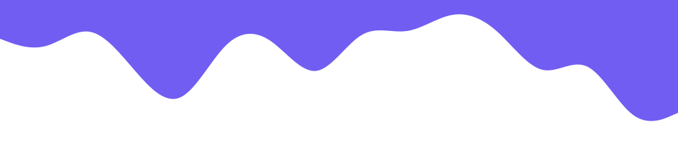

      
  

<h3 align="center">Fullstack Developer | Web Freelancer</h3>

  <em>
    I am a <b>Web Fullstack developer</b>. Has a great fondness for <b>code</b> 
     enjoys learning <b>new technologies</b>  and discovering the <b>essence of problems.</b>
  </em>
   
   <b><i align="center">Thought : "Life is full of choices…choose wisely!”</i></b> 

 

###  **_About Me_**

- 🌱 From: [**Danang, Vietnam**](https://maps.app.goo.gl/gq5sLsqTk2jdT9hi7) 🇻🇳
- 🏆 My portfolio: [**Quoc Nguyen Vu**](https://quocnguyen.netlify.app/)
- 📫 Ask me anything you want [**here**](https://github.com/quocnguyenvu/quocnguyenvu/issues), If I were alive, I would reply within seconds 😉
- 😄 Fun fact: I am always trying to learn new things. After I sleep, I will forget everything

 

### **_🛠 Tools & Technologies_**

&nbsp;

&nbsp;

&nbsp;

&nbsp;

&nbsp;

&nbsp;

&nbsp;

&nbsp;

&nbsp;

&nbsp;

&nbsp;

&nbsp;

&nbsp;

&nbsp;

&nbsp;

&nbsp;

&nbsp;

&nbsp;

&nbsp;

&nbsp;

 

### **_📊 GitHub Profile Stats_**

  
  
   

<b>Note:</b> Top languages is only a metric of the languages my public code consists of and doesn't reflect experience or skill level.

⚡ Recent GitHub Activity

 

 

  <i>Let's connect and chat! Open to anything under the sun.</i>

  

    
	  
	  
  

  

      
  

