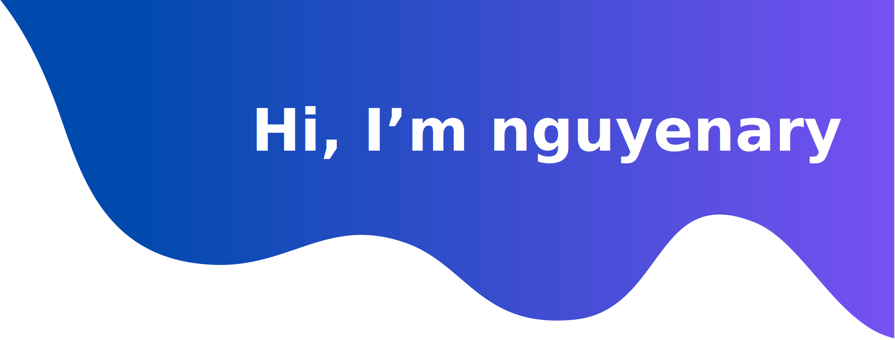

<h3 align="center">Software Engineer</h3>

  <em>
    I am a self-taught <b>Software Engineer</b>. Has a great fondness for <b>code</b> 
     enjoys learning <b>new technologies</b>  and discovering the <b>essence of problems.</b>
  </em> 
   
   <b><i align="center">Thought : "Life is full of choices…choose wisely!”</i></b> 

 

###  ***About Me***

* 🌱 I'm learning ***Javascript*** and ***ReactJS*** 😍
* 🏆 I usually work with ***PHP language***
* 📫 Ask me anything you want [**here**](https://github.com/nguyenary/nguyenary/issues), If I were alive, I would reply within seconds 😉
* 😄 Fun fact: I am always trying to learn new things. After I sleep, I will forget everything

 

### ***🛠 Tools & Technologies***

&nbsp;
&nbsp;
&nbsp;
&nbsp;
&nbsp;
&nbsp;
&nbsp;
&nbsp;
&nbsp;\

&nbsp;
&nbsp;
&nbsp;
&nbsp;

&nbsp;\
&nbsp;
&nbsp;
&nbsp;
&nbsp;
&nbsp;
&nbsp;\
&nbsp;
&nbsp;
&nbsp;
&nbsp;
&nbsp;

 

### ***📊 GitHub Profile Stats***

  
  
 
<b>Note:</b> Top languages is only a metric of the languages my public code consists of and doesn't reflect experience or skill level.

  
⚡ Recent GitHub Activity

   
   
   

  <i>Let's connect and chat! Open to anything under the sun.</i>

  

    	<code></code>
	<code></code>
	<code></code>
	<code></code>
  

  

      
  

